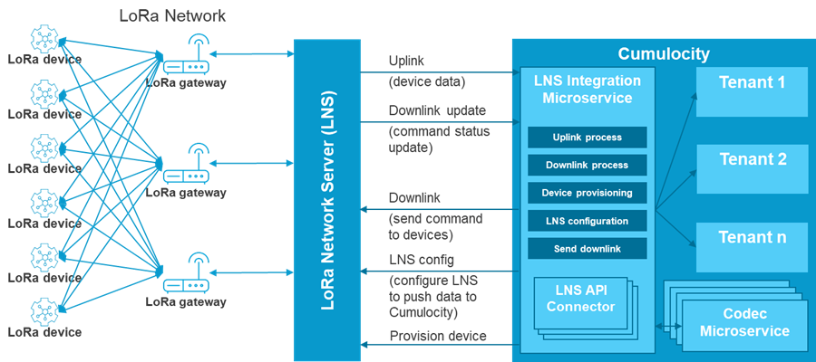

# LoRa framework documentation

This framework is composed of 2 parts:

* LoRa Network Server (LNS) connectivity which is responsible for:

    * handling both uplink and downlink

    * providing wizard steps for UI to create a new connector

    * handling calls to LNS API in order to:

        * configure the LNS for pushing data to Cumulocity

        * provision/deprovision devices

* Device codec which is responsible for:

    * decoding uplink to Cumulocity data

    * encoding Cumulocity operations to downlink commands

    * listing device supported operations per model (one codec can support multiple models)

    * listing supported models

LNS Connectors as well as codecs are multitenant microservices that can fully scale.

## General architecture



The diagram shows the general architecture of the framework. The assumption is that the physical LoRaWAN devices are connected to LoRaWAN gateways that are connected to a LoRaWAN Network Server (LNS). All integration will be through the APIs of that LNS used by an LNS Integration Microservice hosted inside Cumulocity IoT. Each new LNS requires its own integration microservice. The LNS Integration Microservice interacts with Device Codec Microservices that translate the device-specific data formats into the Cumulocity data model of measurements, events, and alarms. A Device Codec Microservice will typically support multiple models from the same device vendor.

To allow users to configure connections to new LNS and add new devices, the standard Cumulocity IoT Device Management application is extended with:
* Configuration screens to manage LNS and LoRaWAN devices
* A custom codec screen with a source code editor to allow for ad-hoc implementation of new codecs
* A LoRa tab for the individual devices to manage these devices

## Build & Deployment

The individual device codecs and LNS integrations are build as individual microservices. The build & deployment instructions for each can be found in the individual sub-projects. For the Java microservices, the common sub-projects on which the microservices are based need to be installed into either a local or remote repository:

```
mvn install --projects lora-interface,lora-codec-ms,lora-ns-ms
```

The user interface is an extended version of the Device Management application of Cumulocity IoT and it can be built and deployed like any other Cumulocity IoT web application. The custom Device Management application is built using npm and c8ycli (https://cumulocity.com/guides/web/development-tools/#c8y-cli) . The "web" sub-folder contains the versions for different Cumulocity IoT releases. To build it run the following commands (the first step is only required after the dependencies have been changed):

```
npm install
npm run-script build
c8ycli deploy
```

The last command will prompt for the tenant to deploy to and your credentials.

## How to create a new connector

You'll need the following Maven dependency to start writing a new connector:

```XML
<dependency>
    <groupId>com.softwareag</groupId>
    <artifactId>lora-ns-ms</artifactId>
    <version>${project.version}</version>
</dependency>

```

You'll have to extend and implement 2 abstract classes and 1 interface:

### Interfaces and classes to extend/implement
1. Abstract class `LNSIntegrationService<C extends LNSConnector>`

This abstract class which is responsible for processing messages coming from the LNS exposes the following abstract methods:

* `DeviceData processUplinkEvent(String eventString)`

This method processes uplinks sent by the LNS.

Uplink is passed as a string that can contains any kind of data (can be JSON, XML, etc...).

The method must produce a `DeviceData` object which is described later in this chapter.

* `OperationData processDownlinkEvent(String eventString)`

This method processes downlink updates sent by the LNS.

Downlink update is passed as a string that can contains any kind of data (can be JSON, XML, etc...).

The method must produce an `OperationData` object which is described later in this chapter.

* `boolean isOperationUpdate(String eventString)`

This is a convenient method that can be used when the LNS supports only one route for both uplinks and downlink updates.

2. Abstract class `LNSAbstractConnector`

This abstract class which implements the `LNSConnector` interface and is responsible for calling the LNS API exposes the following abstract methods:

* `void init()`

This is where you initialize the connector, for example by creating an instance of an HTTP client to the LNS that will be reused by below methods.

* `configureRoutings(String url, String tenant, String login, String password)`

This method will configure the LNS to push data to Cumulocity tenant specified by passed parameters.

* `removeRoutings()`

This method will remove LNS push configuration. Invoked when you delete a connector.

* `boolean provisionDevice(DeviceProvisioning deviceProvisioning)`

This method will provision a device in the LNS and create the device with Cumulocity.
The new device will have its deveui as an external Id.

* `boolean deprovisionDevice(String deveui)`

This method will deprovision a device in the LNS and is called when you delete a device from the LoRa devices UI.

* `Optional<EndDevice> getDevice(String devEui)`

This method get info on a device from the LNS.

* `List<EndDevice> getDevices()`

This method get the list of available devices from the LNS (currently not used, so it is safe to ignore it).

* `String sendDownlink(DownlinkData downlinkData)`

This method will send a downlink to the LNS after the Cumulocity operation has been processed by the device codec.

3. Interface `LNSConnectorWizardStep`

This interface must be implemented at least once and added to the `wizard` linked list in the class extending `LNSIntegrationService`.

The reason we need a wizard to configure a LNS connector is because most LNS group their devices in a way or another, and pushing configurations only apply to one of those groups.

For example Kerlink Wanesy groups devices in clusters, Loriot groups them in apps and Objenious in groups.

So generally you have 2 steps to connect a LNS to Cumulocity: first step provides access to the LNS (for example URL and credentials) and second step lets you choose which group of devices you want to connect to Cumulocity.

A `LNSConnectorWizardStep` must provide a `LinkedList` of `PropertyDescription`s.

The last parameter of `PropertyDescription` constructor is the type of the data to display in the UI. It can be:

* `PropertyType.TEXT`

* `PropertyType.PASSWORD`

* `PropertyType.INTEGER`

* `PropertyType.NUMBER`

* `PropertyType.DATETIME`

* `PropertyType.BOOLEAN`

* `PropertyType.LIST`

`PropertyType.LIST` will be used to create a dropdown. Elements of this dropdown will be created by calling the URL given by the `url` parameter passed to the `PropertyDescription` constructor.

For example, say you configure a wizard step like this:

```java
wizard.add(new LNSConnectorWizardStep() {
    private final LinkedList<PropertyDescription> propertyDescriptions = new LinkedList<>();
    {
        propertyDescriptions.add(new PropertyDescription("clusterId", "Cluster", true, null, "/clusters", null, null, null, null, null, PropertyType.LIST));
    }

    @Override
    public String getName() {
        return "Select a cluster";
    }

    @Override
    public LinkedList<PropertyDescription> getPropertyDescriptions() {
        return propertyDescriptions;
    }
});
```
That means that you define a `clusterId` property for your connector and the value of this property needs to be selected in a list provided by the `/clusters` URI.

Your microservice therefore needs to define this REST resource, which can be done this way:

```java
@RestController
public class KerlinkRestController {

	@PostMapping(value = "/clusters", produces = MediaType.APPLICATION_JSON_VALUE, consumes = MediaType.APPLICATION_JSON_VALUE)
	public List<ClusterDto> getClusters(@RequestBody Properties properties) {
		return new KerlinkConnector(properties).getClusters();
	}

}
```

Several important notes here:

* this must be a POST resource

* the list returned by this resource must be a list of structures that must have those 2 properties in order to be used accordingly by the UI:

    * `String name`

    * `Integer id`

Your LNSConnector implementation must expose a constructor that takes a `java.util.Properties` parameter.
If you're extending from LNSAbstractConnector you just have to call the super constructor like this:

```java
public KerlinkConnector(Properties properties) {
    super(properties);
}
```

This allows to create a temporary connector to access the LNS API.

### Framework REST API

The framework automatically exposes its REST API with springfox-swagger-ui.

You can directly view and test the API by adding `/swagger-ui.html` to the URL of the microservice.

Example: `https://lora-dev.cumulocity.com/service/lora-ns-objenious/swagger-ui.html`

## How to create a new codec

Codecs can be written either in Java or Typescript/Javascript

### Java implementation

### Typescript implementation

## Cumulocity Data model

The data model is composed of the following managed objects:

- 1 agent per microservice that centralizes all operations handling
- 1 managed object per connector which stores operations/commands mapping and connection parameters as tenant options (can be encrypted)

------------------------------

These tools are provided as-is and without warranty or support. They do not constitute part of the Software AG product suite. Users are free to use, fork and modify them, subject to the license agreement. While Software AG welcomes contributions, we cannot guarantee to include every contribution in the master project.